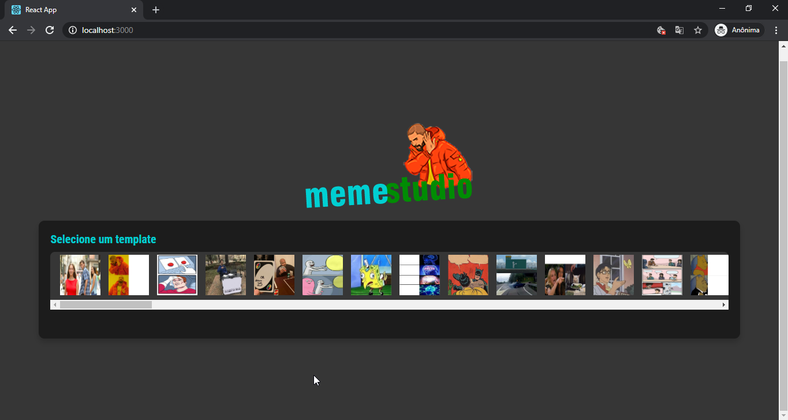
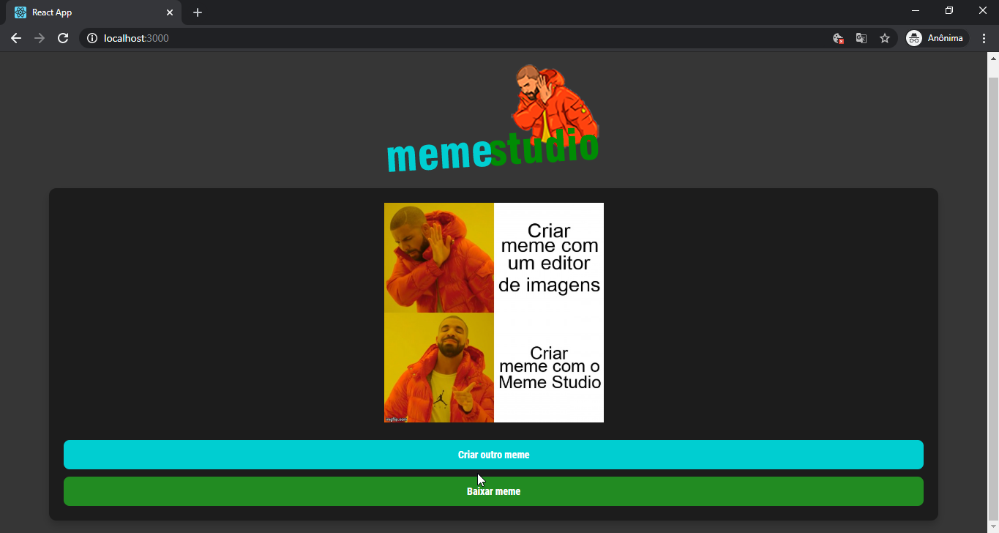

# Gerador de Memes com React

Código fonte do projeto que consiste em um gerador de memes usando React e Styled Components.

Este projeto utiliza o [Create React App](https://github.com/facebook/create-react-app) e a [API do Imgflip](https://api.imgflip.com/).

## Instalação

Você precisará ter apenas o [NodeJS](https://nodejs.org) instalado na sua máquina, e após isso, clonar este repositório em sua máquina

Depois disso acesse a pasta do projeto e instale as dependências executando o seguinte comando:
```sh
  $ yarn install # ou npm install
```

## Executando a aplicação

Execute o comando a baixo para inicializar o servidor de desenvolvimento:
```sh
  $ yarn start # ou npm start
```

Pronto!! Hora de criar memes.


## Algumas imagens do projeto

<div align="center">
    
</div>

<div align="center">
    
</div>

<div align="center">
    
</div>